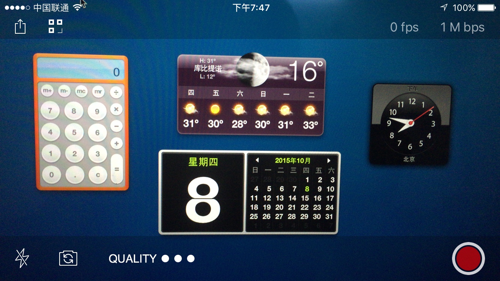

# [技术向] 极拍，五分钟搭建直播业务后端及 App

## 写在开篇前的话

这篇文章及极拍相关项目代码在 15 年就写好了，不过因为种种原因一直没有开放，我已于今年六一（儿童节）正式从七牛离职了，后征求了负责直播项目的 VP 同意可以将这部分内容开源。
说起来在直播团队做的事情还是蛮有趣，尝试了一年半的完全远程办公，从零开始构建直播整体架构，对接第一个客户，招收第一个新成员，一步步走到今天是蛮不容易，不过也很遗憾看到最初的八人小组只剩下两人还在直播组内。

我不敢说自己有什么匠人情怀，只是看到自己做的东西不能被他人知晓会有所失落，毕竟付出了精力和真心换取的如果只是无声的埋没，我想谁都很难在最终的价值认可上获益。

既然要做开放，我想那还是要更为贴近 Pili 原本做事的方式和态度来的，所以单独创建了 Jipai App 这个单独的 Orginization 来做内容的管理，也方便如果有感兴趣的朋友提了 pull request 后便于跟进规整。

## 正文

为什么会有一个叫做极拍的 App 呢？最初是为了测试 Pili 直播业务，后来干脆从界面上和业务逻辑上写的更透彻些，写成了一个基本可以直接上 App Store 的 App。

今天决定将其开源，但还不够，连带后端的实现及 Pili 直播云对接的逻辑一同托出。

先看眼极拍张啥样吧。



## 直播

直播是现阶段很多创业团队在尝试的一个需求点，从媒体运行到美女主播，直播因其时实性和强互动性，具有了与以往录播有别的使用体验。

## 选择

你可以选择自己搭建一台直播服务器，然后自己来从头写一个直播 App；

你也可以选择一个直播云服务，和已有的推流和播放 SDK，分分钟搭建起来一个商用级的直播 App。

显然为了能更快、更好、更专注的解决业务需求，使用公有云服务是最佳实践。这让技术架构更轻便，业务与技术从一开始就清晰分明，聪明的开发者和创业者都会做出正确的选择。

## 架构梳理

在进入具体的编码逻辑前，先从更宏观的角度看一下 App, server 与 Pili Cloud 间的调用关系，如下图：


在对接 Pili 直播云中，你会发现，整个直播中核心的一个对象是 `Stream`。它与传统直播中所说的一路流的概念有些区别，在实际场景中，一个推流端（或一次推流，或一个用户，根据实际业务需求而定）会有它对应的一个 `Stream` 对象。这个 `Stream` 对象通过其 `id` 作为唯一标识。

你并不需要特别的关心 `Stream` 对象中字段的作用，因为 Pili 直播云已经提供了各个语言的 server 端 SDK 供开发者使用，你可以访问 [Pili Engineering 的 GitHub 页面](https://github.com/pili-engineering) 获取。

一个应用在 Pili 直播云会对应一个 `Hub` 的概念，比如我这里的 `Hub` 可以取名为 `jipai-ios`。

### Server 端

我个人写 node 比较顺手，就以 node 为例来做说明对接过程（仍旧作为我厂的 iOS 程序员以写 node 而倔强的存活着（；￣ェ￣））。

我们首先看一下需要的 API

```
POST /streams

创建一个流
```

```
GET /streams/:id

获取一个流
```

```
GET /streams/:id/urls

获取一个流对应的 urls， 通过 query 传递 type 类型
```

以上 3 个接口基本就够极拍使用了。

在 node 中 router 做关联如下：

```
// API
var api_v1Router = new Router();

api_v1Router
    .post('/streams', api_v1.createNewStream)
    .get('/streams/:id', api_v1.getStream)
    .get('/streams/:id/urls', api_v1.getUrls);
```

在 `api_v1` 中，我具体的实现了对 `pili-sdk-nodejs` 的调用。

```
// 从配置中读取 QiniuAK 和 QiniuSK
var ACCESS_KEY = config.qiniu.ak;
var SECRETE_KEY = config.qiniu.sk;

// 读取 HubName
var HUB = config.qiniu.hub;

// 创建 credentials 与 hub 对象
var credentials = new Pili.Credentials(ACCESS_KEY, SECRETE_KEY);
var hub = new Pili.Hub(credentials, HUB);
```

剩下的具体调用按照 [`pili-sdk-nodejs`](https://github.com/pili-engineering/pili-sdk-nodejs) 的 `README` 文档调用对应接口就可以了。

One more thing, [这里](https://github.com/jipaiapp/jipai-server-node)是我实现的极拍 Node.js 版本的 server，可以简单的作为参考。

### App 端

App 端除了 UI 的定制外，主要是集成 `PLCameraStreamingKit` 来直接对接 Pili 直播云。

只需要在 `Podfile` 中添加

```
pod 'PLCameraStreamingKit'
```

然后

```
$ pod install
```

或者

```
$ pod update
```

就集成完毕了。

之后具体的调用可以参见极拍的源码或者 [PLCameraStreamingKit 的 README 文档](https://github.com/pili-engineering/PLCameraStreamingKit)

其中核心的类是 `PLCameraStreamingSession`，整个直播推流过程中基本都是对这个类的实例做的操作。

One more thing，[这里](https://github.com/jipaiapp/jipai-app-ios)是我实现的极拍 iOS App 源码，拿去玩吧。

## 该你试一试了

看完差不多手痒痒了，也该你试一试了。在具有了七牛账号后，你可以通过发送邮件到[这里](mailto:pili@qiniu.com)申请开通直播权限，最好附带上你需要的直播场景和业务描述。

## 引用

- [Jipai iOS App](https://github.com/jipaiapp/jipai-app-ios)
- [Jipai Server in Node.js](https://github.com/jipaiapp/jipai-server-node)
- [Pili Engineering GitHub Pages](https://github.com/pili-engineering)
- [Pili Server-side SDK in Node.js](https://github.com/pili-engineering/pili-sdk-nodejs)
- [Pili iOS Camera live streaming SDK](https://github.com/pili-engineering/PLCameraStreamingKit)

## 与开源内容直接或间接相关的贡献人

- [0dayZh](http://github.com/0dayZh)
  - Jipai App 及 server 端
  - Jipai 产品原型
- [Crystalhoo](https://dribbble.com/crystalhoo)
  - Jipai App && Web 设计师
- [Miclle](https://github.com/miclle)
  - Web 前端
- [Googollee](https://github.com/googollee)
  - Pili 后端架构师 (前)

## License

文档及资源（图片）基于 [CC-BY-DN](https://creativecommons.org/licenses/by-nd/4.0/) 开放授权。
